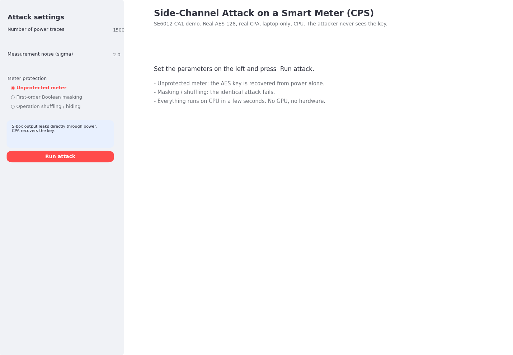
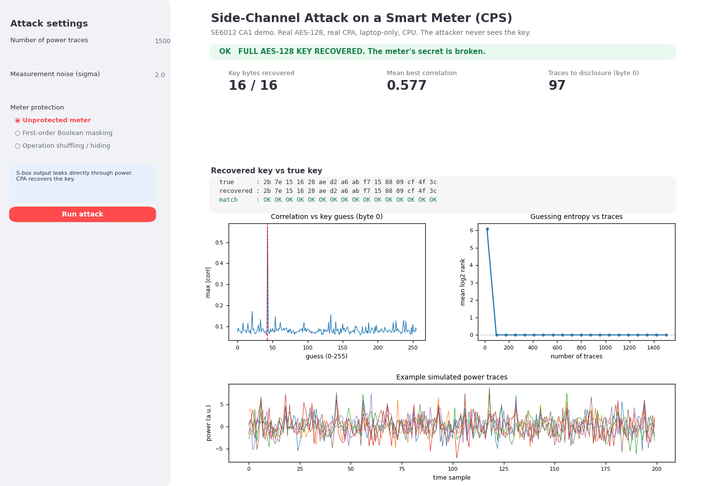
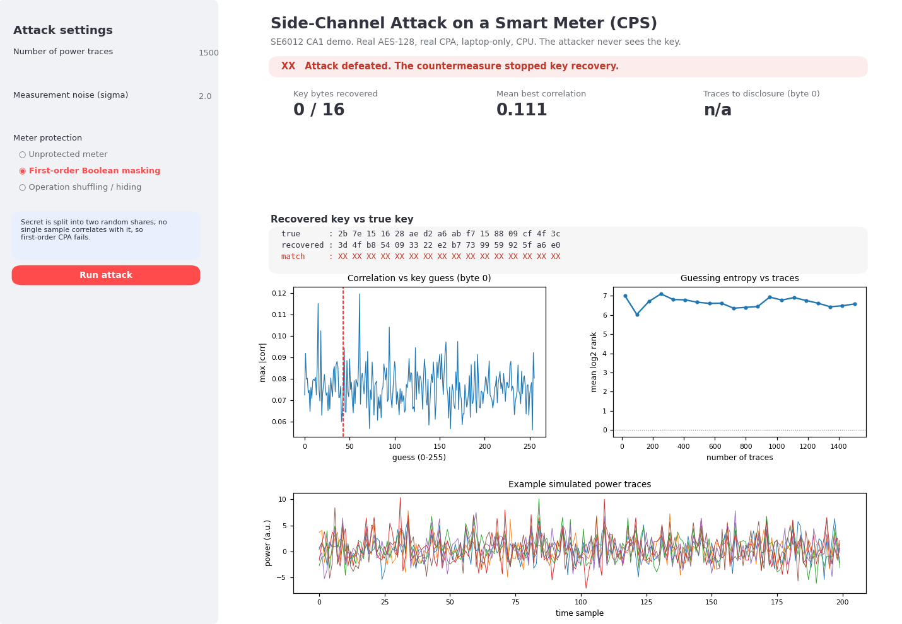
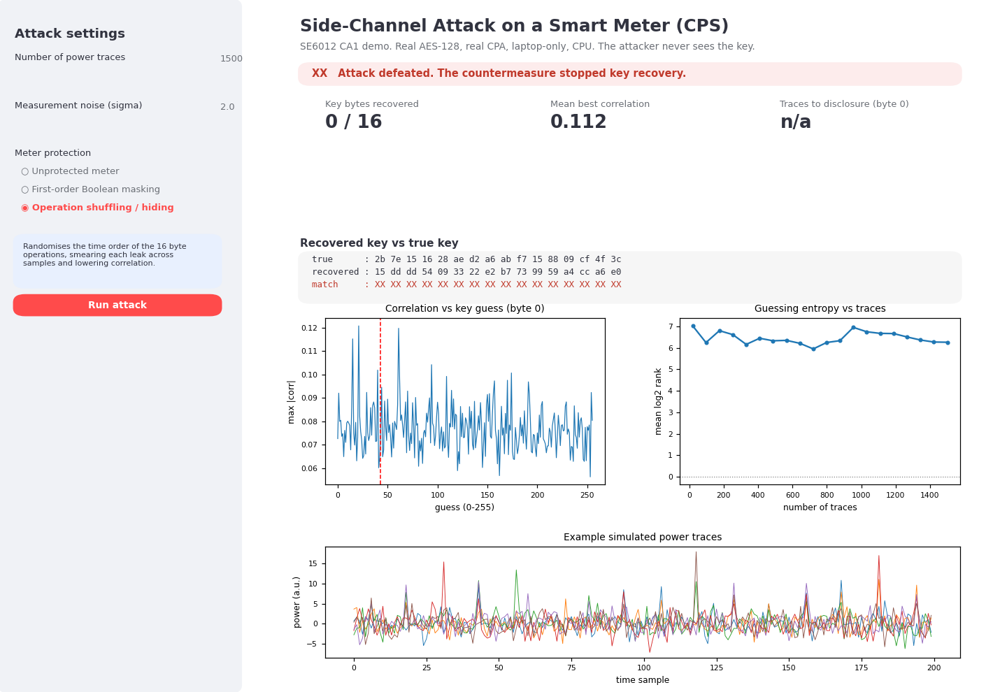
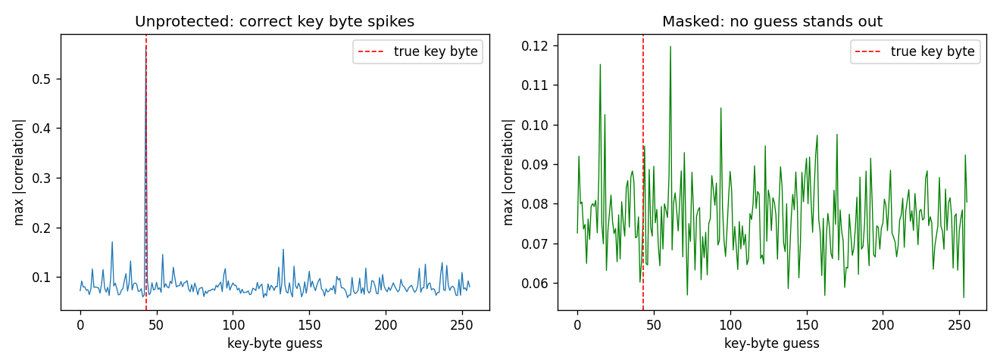
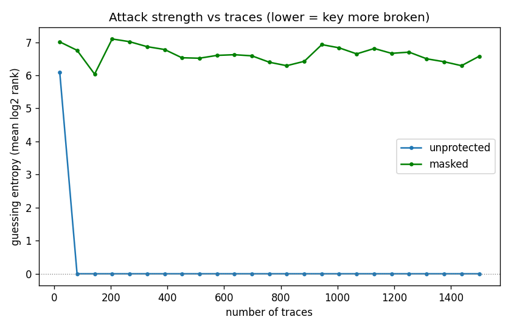

# Side-Channel Attack on a Smart Meter (CPS)

**SE6012 Cyber-Physical System Security, CA1 demo. Team: Ujwal and Markie.**

A laptop-only, CPU-only simulation that recovers a smart meter's AES-128 key
from its power consumption using Correlation Power Analysis (CPA), then defeats
the same attack with masking and shuffling countermeasures. No hardware, no
oscilloscope, no GPU, no paid tools. The whole attack runs in a few seconds.

---

## Table of contents

1. [The one-line story](#the-one-line-story)
2. [What is real vs simulated](#what-is-real-vs-simulated-say-this-in-the-talk)
3. [Quick start (Windows PowerShell)](#quick-start-windows-powershell)
4. [Accessing the Streamlit UI](#accessing-the-streamlit-ui)
5. [What the UI looks like and does](#what-the-ui-looks-like-and-does)
6. [The command-line attack](#the-command-line-attack)
7. [How it works, end to end](#how-it-works-end-to-end)
8. [The metrics explained](#the-metrics-explained)
9. [Project layout](#project-layout)
10. [Mapping to the CA1 rubric](#mapping-to-the-ca1-rubric)
11. [Troubleshooting](#troubleshooting)
12. [FAQ and Q&A prep](#faq-and-qa-prep)

---

## The one-line story

A smart meter encrypts its readings with AES-128, but the chip's power draw
depends on the data it processes. We simulate that leakage, run a real CPA
attack that recovers the secret key from the traces, connect that to the
Confidentiality / Integrity / Availability impact on the grid, then implement
masking to show the attack becomes ineffective.

```
        OUR SIMULATION (all in Python, on the laptop)

   Smart Meter                Power leakage            Attacker
  ┌───────────┐   AES-128    ┌───────────┐   CPA      ┌──────────┐
  │ reading   │ ───────────► │ synthetic │ ─────────► │ recover  │
  │  8.73 kWh │  S-box out   │  traces   │ correlate  │ AES key  │
  └───────────┘              └───────────┘            └────┬─────┘
                                                           │
                        ┌──────────────────────────────────┘
                        ▼
             turn ON masking / shuffling  ─►  same attack now FAILS
```

---

## What is real vs simulated (say this in the talk)

- **Real:** AES-128 (verified against the FIPS-197 known-answer test vector),
  the CPA algorithm (Brier, Clavier, Olivier, CHES 2004), and the masking and
  shuffling countermeasures.
- **Modeled:** the physical power measurement. Instead of an oscilloscope we use
  the standard Hamming-weight leakage model plus Gaussian noise. This is the
  accepted model used across the side-channel field and in teaching tools like
  ChipWhisperer.

The attacker code uses only the known AES input blocks, the traces, and the
public S-box. **It never reads the key.**

---

## Quick start (Windows PowerShell)

Open PowerShell and `cd` into the `CA 1` folder (the one containing
`smartmeter_sca/`). Create and activate a virtual environment named `cps`, then
install dependencies.

```powershell
# 1) create the environment (once)
python -m venv cps

# 2) activate it (every new PowerShell session)
.\cps\Scripts\Activate.ps1

# 3) install dependencies into cps
python -m pip install --upgrade pip
pip install -r smartmeter_sca\requirements.txt
```

Once activated, your prompt shows `(cps)`. If activation is blocked by "running
scripts is disabled on this system", allow it once for your user and re-activate:

```powershell
Set-ExecutionPolicy -Scope CurrentUser -ExecutionPolicy RemoteSigned
.\cps\Scripts\Activate.ps1
```

To leave the environment later: `deactivate`.

---

## Accessing the Streamlit UI

From the `CA 1` folder, with `(cps)` active:

```powershell
streamlit run smartmeter_sca\app\streamlit_app.py
```

Streamlit prints something like:

```
  Local URL:   http://localhost:8501
  Network URL: http://192.168.x.x:8501
```

It normally opens your browser automatically. If not, open
**http://localhost:8501** yourself. Stop the server with **Ctrl + C**.

Useful variants:

```powershell
# pick a different port if 8501 is busy
streamlit run smartmeter_sca\app\streamlit_app.py --server.port 8502

# if the 'streamlit' command is not recognised, run it through Python
python -m streamlit run smartmeter_sca\app\streamlit_app.py

# deep-link straight to a result (also used to make the screenshots below)
#   http://localhost:8501/?auto=none
#   http://localhost:8501/?auto=masking
#   http://localhost:8501/?auto=shuffling
```

To present from a second laptop on the same Wi-Fi, share the **Network URL**.

---

## What the UI looks like and does

> The images below are generated from an actual run of the demo
> (`python -m smartmeter_sca.scripts.make_screenshots`). The plots are exactly
> what the app renders. For a literal browser capture, just run the app and
> screenshot it.

### 1. Landing screen

You choose the number of power traces, the measurement noise, and the meter's
protection, then press **Run attack**.



The three controls on the left:

- **Number of power traces** (100 to 5000): how many encryptions the attacker
  observes. More traces cut through more noise.
- **Measurement noise (sigma)**: how noisy the simulated power measurement is.
  Higher noise needs more traces to succeed, exactly like real hardware.
- **Meter protection**: `Unprotected`, `First-order Boolean masking`, or
  `Operation shuffling / hiding`.

### 2. Unprotected meter: the key falls out

With no protection, CPA recovers all 16 AES key bytes. The success banner turns
green, every byte matches (`OK`), the correlation plot shows the correct guess
spiking far above the noise, and guessing entropy collapses to zero.



What each panel means:

- **Key bytes recovered 16 / 16**: the full 128-bit key was reconstructed.
- **Recovered key vs true key**: the attacker's output next to the real secret;
  all 16 positions read `OK`.
- **Correlation vs key guess (byte 0)**: for one key byte, the correlation of all
  256 candidate guesses. The red dashed line is the true key byte; it is the tall
  spike, which is how the attack "knows" it found the key.
- **Guessing entropy vs traces**: how quickly the attack wins as more traces are
  used. It drops to 0 (key fully known) after roughly 80 to 100 traces.
- **Example simulated power traces**: a few of the synthetic traces the attacker
  is working from.

### 3. Masking on: the same attack fails

Flip the protection to **First-order Boolean masking** and press Run again. The
identical attack now recovers **0 / 16** bytes, the banner turns red, no guess
stands out, and guessing entropy stays high (the key is never found).



### 4. Shuffling on: also defeated

Operation shuffling smears each byte's leak across time, so correlation at any
fixed sample drops and the attack again fails (**0 / 16**).



**The demo arc for your talk:** unprotected (green, key broken) then masking
(red, key safe). That before/after is the +5% moment.

---

## The command-line attack

If you prefer a terminal run (also saves the figures below):

```powershell
python -m smartmeter_sca.scripts.run_attack --n 1500 --noise 2.0
```

Example output (abridged):

```
NONE       ->  16/16 key bytes recovered
MASKING    ->   0/16 key bytes recovered
SHUFFLING  ->   0/16 key bytes recovered
byte 0 traces-to-disclosure (unprotected): ~90 traces
full-key success rate over 15 trials:
   unprotected : 100.0%
   masked      :   0.0%
```

It writes three figures to `smartmeter_sca/figures/`:

**`fig1_correlation.png`** — the correct key byte spikes (left); with masking,
nothing stands out (right).



**`fig2_guessing_entropy.png`** — attack strength vs number of traces. Unprotected
collapses to 0; masked stays high.



Other commands:

```powershell
# unit tests: AES vector + attack sanity (5 tests)
python -m pytest -q

# save a reusable trace dataset (.npz) for offline experiments
python -m smartmeter_sca.scripts.generate_traces --n 2000 --protection none

# regenerate the UI screenshots in this README
python -m smartmeter_sca.scripts.make_screenshots
```

---

## How it works, end to end

**Step 1. The meter encrypts a reading.** `src/meter.py` serialises a kWh
reading into a 16-byte block and AES-128 encrypts it (`src/aes.py`, a real,
FIPS-197-verified implementation). Real AMI meters use a nonce/counter mode
(AES-CTR / AES-GCM), so each message feeds AES a fresh, publicly known input
block; `capture()` models exactly that, which is the standard known-input target
of a CPA on AES-GCM.

**Step 2. The chip leaks power.** `src/leakage.py` models the instantaneous
power at the moment AES computes the first-round S-box output
`SBOX[plaintext XOR key]`. Power at that instant is proportional to the Hamming
weight (number of 1 bits) of that value, buried in Gaussian noise. Every key
byte leaks at its own time sample.

**Step 3. Collect many traces.** The meter is observed encrypting hundreds to a
few thousand different inputs, producing a `[n_traces x n_samples]` array.

**Step 4. CPA recovers the key.** `src/cpa.py`, for each of the 16 key bytes,
tries all 256 candidate values. For a candidate it predicts the leakage
`HW(SBOX[plaintext XOR guess])` and correlates that prediction with every time
sample. The candidate whose prediction best matches the traces is the recovered
key byte. The attacker only ever uses the known inputs, the traces, and the
public S-box.

**Step 5. Countermeasures.** `src/leakage.py` also implements two real defences.
*Masking* splits the secret into two random shares so no single sample
correlates with it; first-order CPA then fails. *Shuffling* randomises the time
order of the 16 byte operations, smearing each leak across samples.

```
meter.py  ─►  leakage.py  ─►  cpa.py  ─►  recovered key
(AES-128)     (HW + noise)     (correlate 256 guesses)
                  ▲
        countermeasure: masking / shuffling  ─►  attack fails
```

---

## The metrics explained

`src/metrics.py` provides the rigorous side-channel evaluation a hardware-security
grader expects:

- **Traces-to-disclosure (TTD):** the smallest number of traces at which the
  correct key byte becomes, and stays, the top guess. Lower means a stronger
  attack. Unprotected here is roughly 80 to 100 traces.
- **Guessing entropy:** the average `log2(rank)` of the correct key across all 16
  bytes as traces increase. It falls to 0 when the key is fully known. This is the
  standard SCA success metric.
- **Success rate:** the fraction of independent repeated experiments that recover
  the full key. Unprotected is 100%; masked is 0%.

---

## Project layout

```
smartmeter_sca/
  README.md                     this file
  requirements.txt
  src/
    aes.py                      real AES-128 + S-box + Hamming weight
    meter.py                    SmartMeter: readings -> AES input blocks
    leakage.py                  power-trace simulation (none / masking / shuffling)
    cpa.py                      CPA attack + key recovery
    metrics.py                  traces-to-disclosure, guessing entropy, success rate
    countermeasure.py           human-readable protection info
  scripts/
    run_attack.py               end-to-end run with figures + metrics
    generate_traces.py          save a reusable trace dataset (.npz)
    make_screenshots.py         regenerate the UI images in this README
  app/
    streamlit_app.py            interactive live demo
  tests/
    test_cpa.py                 AES vector + attack sanity tests
  docs/screenshots/             UI images used above
  figures/                      plots from run_attack
  data/                         saved trace datasets
```

---

## Mapping to the CA1 rubric

- **Positive CPS use case (Comprehensiveness, 35%):** smart-meter / AMI, giving
  accurate billing, outage detection, demand response, and renewables and EV
  integration.
- **Three CIA issues (Issue Analysis, 35%):**
  - **Confidentiality (deep-dive):** a power side channel leaks the AES key.
  - **Integrity:** with the key, forge meter readings or grid telemetry.
  - **Availability:** with the key, replay or issue mass remote-disconnect
    commands to destabilise supply.
- **Deep dive + mitigations (Mitigation, 20%):** the CPA attack here, with
  consequences across safety, operations, and reputation, mitigated by masking
  and hiding (both implemented and demonstrated), per-device key diversification,
  a secure element / root of trust, authenticated lightweight crypto (ASCON), and
  PQC for long-lived keys.
- **Uniqueness (10%) and the demo bonus (+5%):** an implementation-level attack
  with a live, laptop-only simulation that mirrors the course's SCA lab.

---

## Troubleshooting

- **`Activate.ps1 cannot be loaded because running scripts is disabled`** — run
  `Set-ExecutionPolicy -Scope CurrentUser -ExecutionPolicy RemoteSigned` once,
  then activate again.
- **`streamlit` is not recognized** — use `python -m streamlit run
  smartmeter_sca\app\streamlit_app.py`, and confirm `(cps)` is active.
- **Port 8501 already in use** — add `--server.port 8502` (or any free port).
- **Browser did not open** — go to `http://localhost:8501` manually.
- **`ModuleNotFoundError: smartmeter_sca`** — run the commands from the `CA 1`
  folder (the one that contains `smartmeter_sca/`), not from inside it.
- **Blank or slow first load** — the first Streamlit launch compiles caches; give
  it a few seconds, then it is instant.

---

## FAQ and Q&A prep

**Are you faking the attack?** No. The AES, the CPA, and the countermeasures are
real and unmodified. Only the power measurement is modeled, using the standard
Hamming-weight model instead of an oscilloscope.

**Would this work on a real meter?** The principle is identical. Real traces are
noisier and misaligned, so a real attack adds a trace-alignment step and needs
more traces. A natural next step is to run the same CPA against a real measured
dataset (ChipWhisperer / ASCAD).

**Why does the attacker need the plaintext?** CPA is a known-input attack. In a
nonce/counter mode the AES input block is transmitted and therefore known, which
is why AES-GCM implementations are a realistic CPA target.

**Does the attacker use the key?** Never. It uses only the known inputs, the
traces, and the public S-box; the key is used solely to score the result.

**Why is masking enough here but not always?** First-order masking defeats
first-order CPA. Higher-order attacks exist, which is why masking is usually
combined with hiding (shuffling) and a secure element, as noted in the mitigations.
